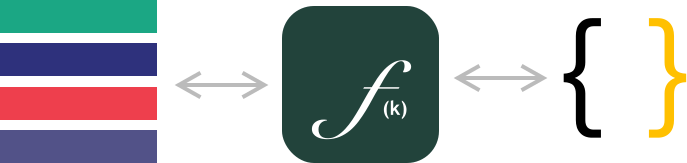
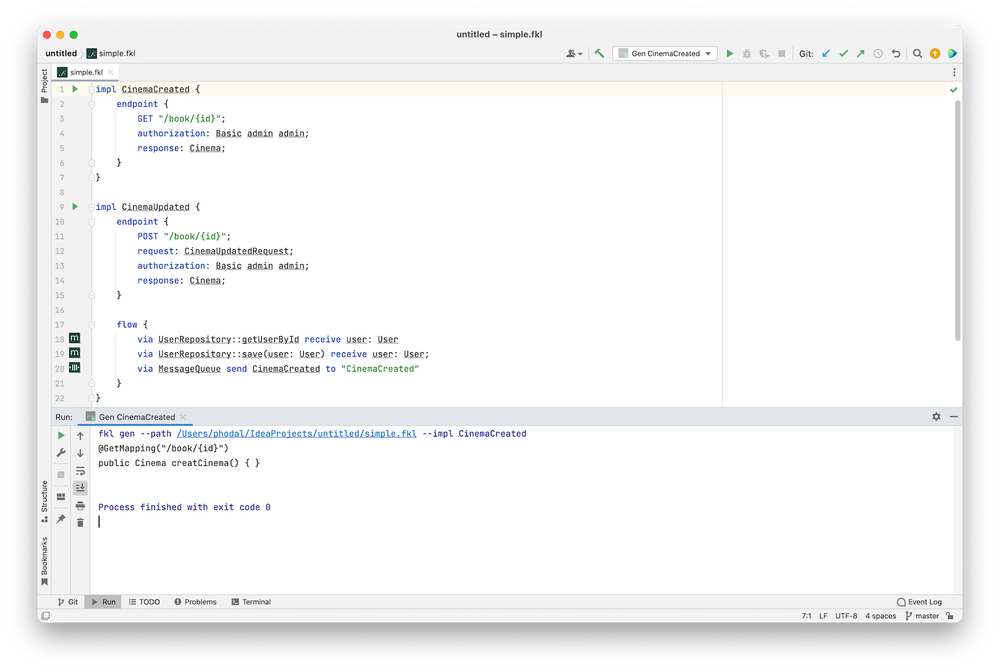
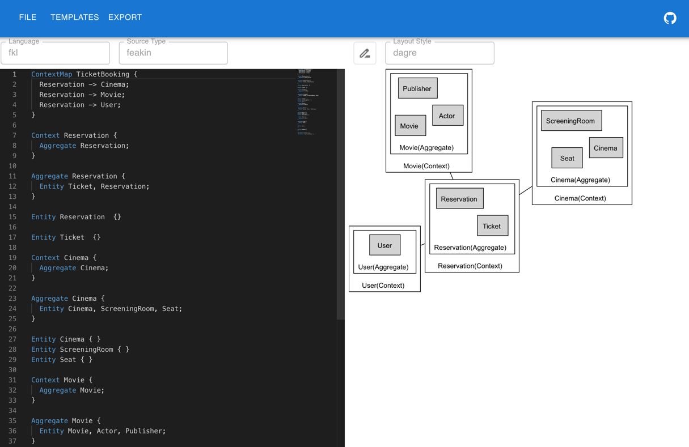

# Feakin 介绍

inspired by: [TypeFlow](https://zhuanlan.zhihu.com/p/341089716)

Feakin 是一个软件架构设计与开发标准化方法，基于 DDD （领域驱动设计）与函数式编程思想。



Feakin 主要组成部分：

- Fklang 是一个架构设计 DSL，以确保软件系统描述与实现的一致性。通过显式化的软件架构设计，用于支持 AI 代码生成系统的嵌入。
- Feakin Intellij Plugin 是 Feakin 的一个 IntelliJ 插件，用于将 Feakin/Fklang 集成到项目中。
- Feakin Web 提供了一个架构设计与可视化协作工具，让架构师能够更加高效地进行架构设计与可视化协作。

设计理念：

1. 架构孪生：双态绑定。提供架构设计态与实现态的双向绑定，保证架构设计与实现的一致性。 
2. 显性化设计意图。将软件设计的意图化，借助于 DSL 语言的特性，将意图转换化代码。
3. 类型与事件驱动。通过事件驱动的方式，将数据类型与领域事件进行绑定。

## Feakin IntelliJ Plugin

安装：[](https://plugins.jetbrains.com/plugin/20026-feakin)



Fklang 示例：

```feakin
impl CinemaCreated {
    endpoint {
        GET "/book/{id}";
        authorization: Basic admin admin;
        response: Cinema;
    }
}

impl CinemaUpdated {
    endpoint {
        POST "/book/{id}";
        request: CinemaUpdatedRequest;
        authorization: Basic admin admin;
        response: Cinema;
    }

    flow {
        via UserRepository::getUserById receive user: User
        via UserRepository::save(user: User) receive user: User;
        via MessageQueue send CinemaCreated to "CinemaCreated"
    }
}
```

## Fklang

下载地址：[https://github.com/feakin/fklang/releases](https://github.com/feakin/fklang/releases)

```shell
Usage: fkl <COMMAND>

Commands:
  gen    Generate code from a fkl file, current support Java
  dot    Generate dot file from a fkl file
  parse  Parse a fkl file and print the AST
  help   Print this message or the help of the given subcommand(s)

Options:
  -h, --help  Print help information
```

CLI 示例：

```shell
fkl gen --path /Users/phodal/IdeaProjects/untitled/simple.fkl --impl CinemaCreated

@GetMapping("/book/{id}")
public Cinema creatCinema() { }
```

## Feakin Web

在线地址：[https://online.feakin.com/](https://online.feakin.com/)



对应 Fklang 示例：

```feakin
ContextMap TicketBooking {
  Reservation -> Cinema;
  Reservation -> Movie;
  Reservation -> User;
}

Context Reservation {
  Aggregate Reservation;
}

Aggregate Reservation {
  Entity Ticket, Reservation;
}

Entity Reservation  {

}

Entity Ticket  {}

Context Cinema {
  Aggregate Cinema;
}

Aggregate Cinema {
  Entity Cinema, ScreeningRoom, Seat;
}

Entity Cinema { }
Entity ScreeningRoom { }
Entity Seat { }

Context Movie {
  Aggregate Movie;
}

Aggregate Movie {
  Entity Movie, Actor, Publisher;
}

Entity Movie { }
Entity Actor { }
Entity Publisher { }

Context User {
  Aggregate User;
}

Aggregate User {
  Entity User;
}

Entity User {

}

Entity Payment {}

ValueObject Price { }
ValueObject Notifications { }
```


