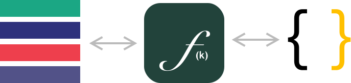

# 设计理念

1. 架构孪生：双态绑定。提供架构设计态与实现态的双向绑定，保证架构设计与实现的一致性。
2. 显性化设计意图。将软件设计的意图化，借助于 DSL 语言的特性，将意图转换化代码。
3. 类型与事件驱动。通过事件驱动的方式，将数据类型与领域事件进行绑定。



简单来说，通过声明式 DSL 来绑定代码实现与架构设计，保证架构设计与实现的一致性。

## 架构孪生：双态绑定

## 显性化设计意图

### 声明式编程

声明式编程（英语：Declarative programming）是一种编程范式，与命令式编程相对立。 它描述目标的性质，让计算机明白目标，而非流程。

### 显性化子任务

```feakin
impl CinemaUpdated {
   ...
   flow {
      via UserRepository::getUserById receive user: User
      via UserRepository::save(user: User) receive user: User;
      via MessageQueue send CinemaCreated to "CinemaCreated"
   }
}
```

## 类型与事件驱动

在设计理念中，我们将代码逻辑分为两个部分：**状态**和**行为**。状态是指数据，行为是指数据的操作。在我们的设计中，状态和行为是分离的，状态是不可变的，行为是可变的。这种设计的好处是，我们可以在不同的状态之间进行切换，而不需要重新创建行为。这种设计的缺点是，我们需要在状态和行为之间进行绑定，这样才能保证状态和行为的一致性。 对应实现上，状态既是类型，行为视为事件。


《函数响应式领域建模》中的 Scala 示例：

```scala
trait Account {
  def name: String
  def balance: BigDecimal
}

case class OpenedAccount(..) extends Account

trait InterestBearingAccount extends Account {
  def interestRate: BigDecimal
}

case class SavingAccount(..) extends InterestBearingAccount
case class MoenyMarketAccount(..) extends InterestBearingAccount

trait AccountService {
  def calculateInterest(..): BigDecimal
}
```

### 纯函数

### 领域事件
