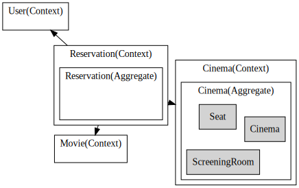
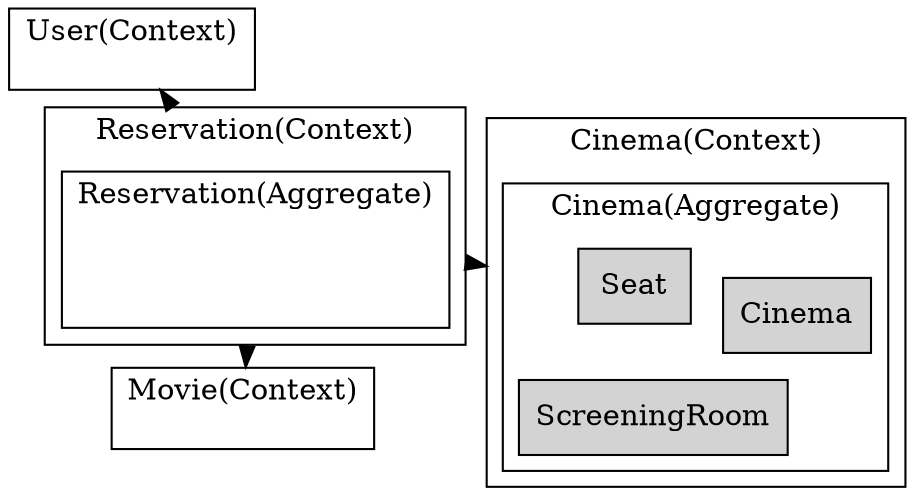

# DDD in Feakin

Feakin 的 DDD 语法参考了：[https://contextmapper.org/docs/context-map/](https://contextmapper.org/docs/context-map/)

Feakin 语法可以实现三个阶段：

- 战略设计。语法：`ContextMap`、`Context`
- 战术设计。语法：`Aggregate`、`Entity`、`ValueObject`
- 实现。语法：`impl`

## Quick Start

1. 在线编辑器：[https://online.feakin.com/](https://online.feakin.com/)
2. 在 `Template` -> `DDD Booking` 使用 Feakin 语法设计

```feakin
ContextMap TicketBooking {
    Reservation -> Cinema;
    Reservation -> Movie;
    Reservation -> User;
}

Context Reservation {
  Aggregate Reservation;
}

Context Cinema {
  Aggregate Cinema;
}

Aggregate Cinema {
  Entity Cinema, ScreeningRoom, Seat;
}
```

生成如下图所示的结果：



详细过程：

1. Fklang 编译器会转义 fkl 为 Dot 语法 
2. Feakin Render 渲染 Dot 语法

生成的 DOT 代码如下所示：




## DDD Strategy 

### Step 1. Design Context Map

表示领域上下文图，用于描述系统的边界。

```feakin
ContextMap TicketBooking {
  Reservation -> Cinema;
  Reservation -> Movie;
  Reservation -> User;
}
```

关系：

- `-` - Undirected,
- `->` - PositiveDirected,
- `<-` - NegativeDirected,
- `<->` - BiDirected,

### Step 2. Context

表示限界上下文，以及对应的聚合间的关系。

```feakin
Context Reservation {
  Aggregate Reservation;
}
```

## DDD tactics

### Step 1. DomainObject

表示领域对象，包括：聚合、实体、值对象。

```feakin
Aggregate Reservation {
  Entity Ticket, Reservation;
}
```

```feakin
Entity Reservation  {
  
}
``` 

## 附录：在线示例代码

```
ContextMap TicketBooking {
  Reservation -> Cinema;
  Reservation -> Movie;
  Reservation -> User;
}

Context Reservation {
  Aggregate Reservation;
}

Aggregate Reservation {
  Entity Ticket, Reservation;
}

Entity Reservation  {}

Entity Ticket  {}

Context Cinema {
  Aggregate Cinema;
}

Aggregate Cinema {
  Entity Cinema, ScreeningRoom, Seat;
}

Entity Cinema { }
Entity ScreeningRoom { }
Entity Seat { }

Context Movie {
  Aggregate Movie;
}

Aggregate Movie {
  Entity Movie, Actor, Publisher;
}

Entity Movie { }
Entity Actor { }
Entity Publisher { }

Context User {
  Aggregate User;
}

Aggregate User {
  Entity User;
}

Entity User {
}

Entity Payment {
}

ValueObject Price { }
ValueObject Notifications { }
```
