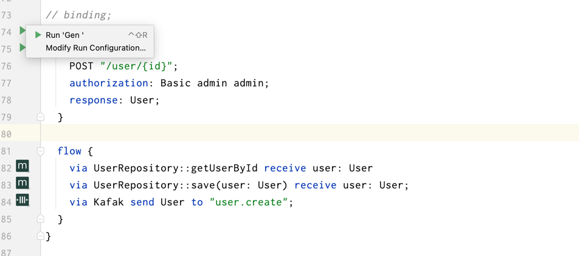

# Chapter 2 - Binding Implementation

本节需要结合 IDEA 插件使用：[](https://plugins.jetbrains.com/plugin/20026-feakin)



编写后 Binding 之后，在左侧点击 `Run 'Gen'` 即可生成代码。

## Implementation DomainEvent

创建 API 时，需要绑定领域事件到实现。

```feakin
impl UserCreated {
    endpoint {
        POST "/user/{id}";
        authorization: Basic admin admin;
        response: User;
    }

    flow {
        via UserRepository::getUserById receive user: User
        via UserRepository::save(user: User) receive user: User;
        via Kafak send User to "user.create";
    }
}
```

## Layered Implementation

在配置了如下的分层之后，将直接添加到 Controller 中：

```feakin
layered DDD {
    dependency {
        "interface" -> "application"
        "interface" -> "domain"
        "domain" -> "application"
        "application" -> "infrastructure"
        "interface" -> "infrastructure"
    }
    layer interface {
        package: "com.feakin.demo.rest";
    }
    layer domain {
        package: "com.feakin.demo.domain";
    }
    layer application {
        package: "com.feakin.demo.application";
    }
    layer infrastructure {
        package: "com.feakin.demo.infrastructure";
    }
}
```
