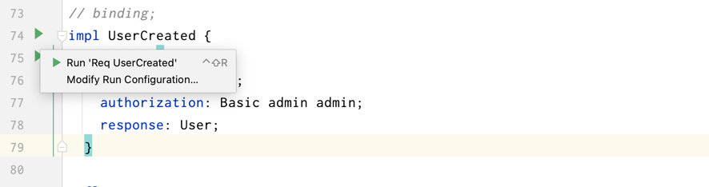

# Code Generator

> code generator for fklang

Download from: [https://github.com/feakin/fklang/releases](https://github.com/feakin/fklang/releases)

```bash
Feakin is a architecture design and visual collaboration tool. This is the parser for Feakin.

Usage: fkl <COMMAND>

Commands:
  dot   generate Graphviz/Dot from fkl file
  ast   generate ast from fkl file
  gen   generate code from fkl file
  run   run function from fkl file
  help  Print this message or the help of the given subcommand(s)

Options:
  -h, --help     Print help information
  -V, --version  Print version information
```

## Basic: generate method

sample code:

```feakin
impl HelloGot {
    endpoint {
        GET "/hello";
        response: String;
    }
}
```

output:

```java
@GetMapping("/hello")
public String gotHello() {

}
```

## Auto insert: Aggregate and Layered

declaration with aggregate and layered:

```feakin
impl HelloGot {
    aggregate: Hello; // here
    endpoint {
        GET "/hello";
        response: String;
    }
}

layered DDD {
    layer interface {
        package: "com.feakin.demo.rest";
    }
    layer domain {
        package: "com.feakin.demo.domain";
    }
    layer application {
        package: "com.feakin.demo.application";
    }
    layer infrastructure {
        package: "com.feakin.demo.infrastructure";
    }
}
```

with insert code to: `src/main/java/com/feakin/demo/rest/Controller.java`

```java
@GetMapping("/hello")
public String gotHello() {

}
```


在生成代码时，会先检查已有的 Event 是否存在于 Controller 中，如果存在则报错，如果不存在则自动插入。

过程：

1. 使用 TreeSitter 解析目标源码，生成 AST
2. 查找对应生成的方法是否已经存在

## Test with Http Request

编写用例：

```feakin
impl GitHubOpened {
    endpoint {
        GET "https://book.feakin.com/";
        response: String;
    }
}

impl FeakinJson {
    endpoint {
        GET "https://raw.githubusercontent.com/feakin/vscode-feakin/master/package.json";
        response: String;
    }
}
```

测试：



点击 `endpoint` 左侧的运行按钮，即可运行用例。

Run by Cli

```bash
$ fkl run --main ./test_data/cli/impl.fkl --impl GitHubOpened --func request
```
