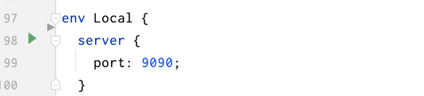

# Chapter 6 - Mock Server

Run by CLI:

```bash
$ fkl run --main docs/samples/impl.fkl  --func mock-server --env Local
```

Run by IDE:



## API Mock Server

Feakin 通过 Mock Server 来模拟 API 的返回结果，以便于前端开发人员在没有后端 API 的情况下进行开发。

处理逻辑：

1. 从 Feakin 项目中读取 Struct 的定义：`context` -> `aggregate` -> `entity`
2. 解析 Struct 的定义，生成对应的 Builtin Type
3. 转换 Builtin Type 为 Mock Type
4. 根据 Mock Type 生成 Fake Values
5. 返回 Response

### Builtin Type

```rust
#[derive(Serialize, Deserialize, Debug, Clone, PartialEq, Eq)]
pub enum BuiltinType {
  Any,
  String,
  Integer,
  Float,
  Boolean,
  Date,
  DateTime,
  Timestamp,
  Array(Vec<BuiltinType>),
  Map(HashMap<String, BuiltinType>),
  Special(String),
}
```

### Mock Type


```rust
#[derive(Deserialize, Debug, Clone, PartialEq)]
pub enum MockType {
  Null,
  // Optional(Box<MockType>),
  /// basic type
  Unknown(String),
  String(String),
  Integer(i64),
  Float(f64),
  Boolean(bool),
  /// structural type
  Array(Vec<MockType>),
  Map(IndexMap<String, MockType>),
  // additional type
  Date(String),
  DateTime(String),
  Timestamp(i64),
  Uuid(String),
}
```
